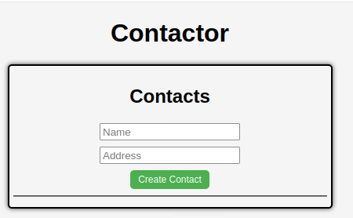
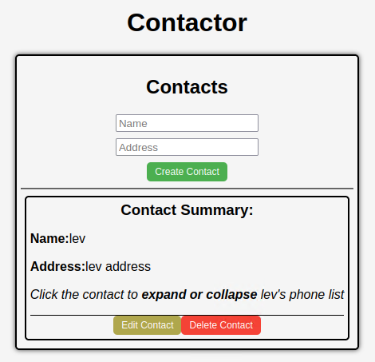
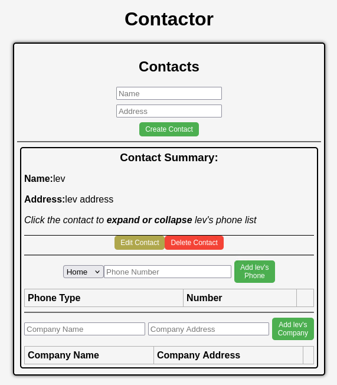
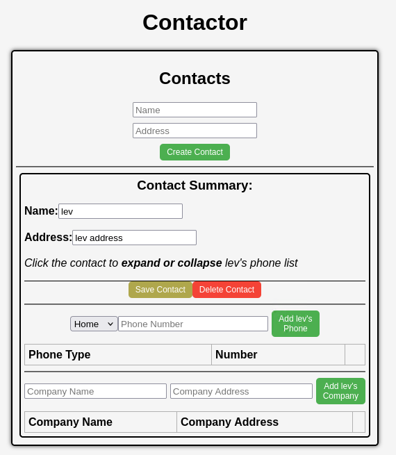
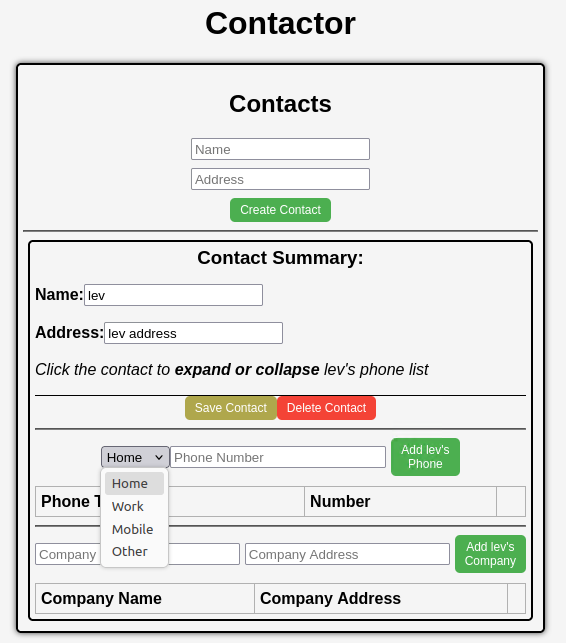
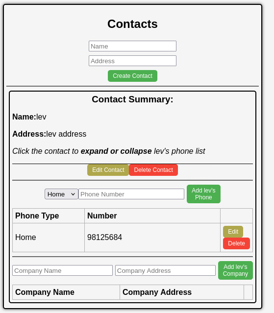
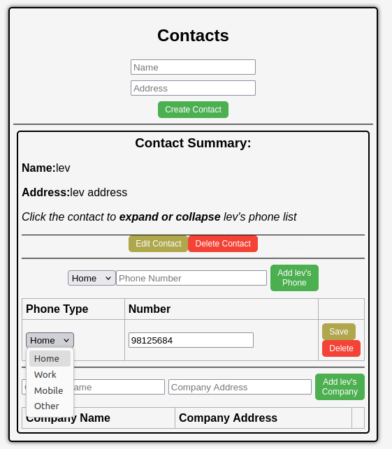
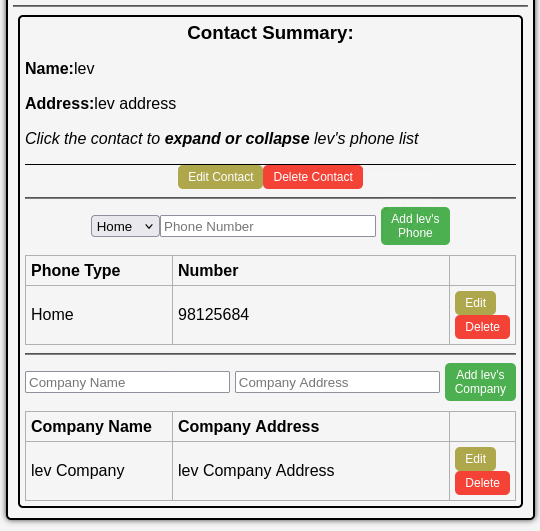
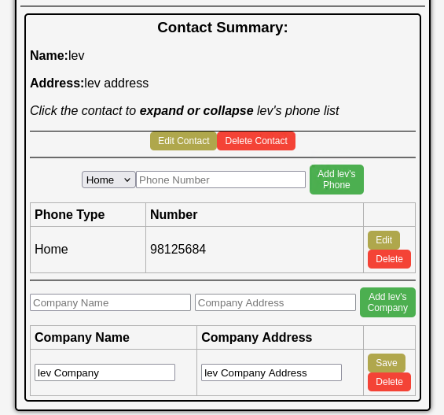

# README.md

IMPORTANT: Once you've cloned this to your forked repository, ensure that you continuously update this document as you complete each task to demonstrate your ongoing progress.

Levin's shared repository: https://github.com/22928079/Assignment2-22928079.git

## Access Database
1 **Plsql Cheat Sheet:**
You can refer to the PostgreSQL cheat sheet [here](https://www.postgresqltutorial.com/postgresql-cheat-sheet/).

2 **Know the Container ID:**
To find out the container ID, execute the following command:
   ```bash
   docker ps
      fbd7d5fba1ce   assignment2-22928079-nginx      "/docker-entrypoint.…"   46 hours ago   Up 46 hours   0.0.0.0:80->80/tcp, [::]:80->80/tcp   assignment2-22928079-nginx-1
      a4db15a71d60   assignment2-22928079-frontend   "docker-entrypoint.s…"   46 hours ago   Up 46 hours   3000/tcp                              assignment2-22928079-frontend-1
      9bc46fb686b5   assignment2-22928079-api        "docker-entrypoint.s…"   46 hours ago   Up 46 hours   5000/tcp                              assignment2-22928079-api-1
      317f622564ac   postgres:15.3-alpine3.18        "docker-entrypoint.s…"   46 hours ago   Up 46 hours   5432/tcp                              assignment2-22928079-db-1
   ```
3. Running the application

**docker compose command:**
   ```bash
   docker compose up --build
   ```

4 **Access postgreSQL in the container:**
Once you have the container ID, you can execute the container using the following command:
You will see the example of running the PostgreSQL inside the container.
   ```bash
   docker exec -it assignment2-22928079-db-1 psql -U postgres
   vboxuser@CSE5006:~$ docker exec -it assignment2-22928079-db-1 psql -U postgres
   psql (15.3)
   Type "help" for help.

    postgres=# \dt
           List of relations
    Schema |   Name    | Type  |  Owner   
   --------+-----------+-------+----------
    public | companies | table | postgres
    public | contacts  | table | postgres
    public | phones    | table | postgres
    (3 rows)

  
    postgres=# select * from contacts;
    id | name |   address   |         createdAt          |         updatedAt          
   ----+------+-------------+----------------------------+----------------------------
     1 | lev  | lev address | 2025-08-25 12:46:01.707+00 | 2025-08-25 12:46:01.707+00
    (1 row)

    postgres=# select * from phones;
    id | phone_type | phone_number | contactId |         createdAt          |         updatedAt          
   ----+------------+--------------+-----------+----------------------------+----------------------------
     1 | Work       | 1234565      |         1 | 2025-08-25 12:56:56.118+00 | 2025-08-25 12:56:56.118+00
    (1 row)
   postgres=# select * from companies;
    company_id | company_name |   company_address   | contact_id |         createdAt         |         updatedAt         
   ------------+--------------+---------------------+------------+---------------------------+---------------------------
             1 | lev Company  | lev company address |          1 | 2025-08-25 12:58:31.81+00 | 2025-08-25 12:58:31.81+00
   (1 row)

   ```

## Executing API

### Contact API

1. Add Contacts API  (POST)  
http post http://localhost/api/contacts name="{name_for_contact}" address="{address_for_contact}"  
Create a new contact using the payload data.

```bash
http post http://localhost/api/contacts name="Levin" address="Levin Address"

vboxuser@CSE5006:~$ http post http://localhost/api/contacts name="Levin" address="Levin Address"
HTTP/1.1 200 OK
Access-Control-Allow-Origin: http://localhost:3000
Connection: keep-alive
Content-Length: 116
Content-Type: application/json; charset=utf-8
Date: Mon, 25 Aug 2025 13:02:02 GMT
ETag: W/"74-IZgSso1PV2ifb3t2i04i3HM49U0"
Server: nginx/1.25.1
Vary: Origin
X-Powered-By: Express

{
    "address": "Levin Address",
    "createdAt": "2025-08-25T13:02:02.048Z",
    "id": 2,
    "name": "Levin",
    "updatedAt": "2025-08-25T13:02:02.048Z"
}

```
2. Get Contacts API  (GET)  
http get http://localhost/api/contacts  
Returns a list of all existing Contacts.

```bash
http get http://localhost/api/contacts

vboxuser@CSE5006:~$ http get http://localhost/api/contacts
HTTP/1.1 200 OK
Access-Control-Allow-Origin: http://localhost:3000
Connection: keep-alive
Content-Length: 253
Content-Type: application/json; charset=utf-8
Date: Mon, 25 Aug 2025 13:03:22 GMT
ETag: W/"fd-Ko7AZlnW+EDdwZFl9IidcIGqm94"
Server: nginx/1.25.1
Vary: Origin
X-Powered-By: Express

[
    {
        "address": "lev address",
        "createdAt": "2025-08-25T12:46:01.707Z",
        "id": 1,
        "name": "lev",
        "updatedAt": "2025-08-25T12:46:01.707Z"
    },
    {
        "address": "Levin Address",
        "createdAt": "2025-08-25T13:02:02.048Z",
        "id": 2,
        "name": "Levin",
        "updatedAt": "2025-08-25T13:03:02.501Z"
    }
]

```
3. Delete Contacts API (DELETE)  
http delete http://localhost/api/contacts/{contact_id}  
Delete the contact with ID provided in parameter
```bash
http delete http://localhost/api/contacts/2

vboxuser@CSE5006:~$ http delete http://localhost/api/contacts/2
HTTP/1.1 200 OK
Access-Control-Allow-Origin: http://localhost:3000
Connection: keep-alive
Content-Length: 47
Content-Type: application/json; charset=utf-8
Date: Mon, 25 Aug 2025 13:10:56 GMT
ETag: W/"2f-i0D5Qo4IGfH+OpTTITmyTnSzFvU"
Server: nginx/1.25.1
Vary: Origin
X-Powered-By: Express

{}
```

4. Update Contacts API (PUT)  
http put http://localhost/api/contacts/{contact_id} name="{name_to_change}" address="{address_to_change}"
``` bash
http put http://localhost/api/contacts/2 name="Levin Update" address="Levin Address Update"

vboxuser@CSE5006:~$ http put http://localhost/api/contacts/2 name="Levin Update" address="Levin Address Update"
HTTP/1.1 200 OK
Access-Control-Allow-Origin: http://localhost:3000
Connection: keep-alive
Content-Length: 47
Content-Type: application/json; charset=utf-8
Date: Mon, 25 Aug 2025 13:06:54 GMT
ETag: W/"2f-9DEigpdI8FmatdY6qgJYc7CM5hQ"
Server: nginx/1.25.1
Vary: Origin
X-Powered-By: Express

{
    "address": "Levin Address Update",
    "createdAt": "2025-08-25T13:02:02.048Z",
    "id": 2,
    "name": "Levin Update",
    "updatedAt": "2025-08-25T13:06:54.871Z"
}

```

### Phone API

1. Add Phones API  (POST)  
http post http://localhost/api/contacts/{contact_id}/phones phone_type="{type_for_phone}" phone_number="{phone_number}"

```bash
http post http://localhost/api/contacts/1/phones phone_type="Home" phone_number="323123123"

vboxuser@CSE5006:~$ http post http://localhost/api/contacts/1/phones phone_type="Home" phone_number="323123123"
HTTP/1.1 200 OK
Access-Control-Allow-Origin: http://localhost:3000
Connection: keep-alive
Content-Length: 147
Content-Type: application/json; charset=utf-8
Date: Mon, 25 Aug 2025 13:27:07 GMT
ETag: W/"93-xfcVhhQIhNxQ1HRH81IQosRhA64"
Server: nginx/1.25.1
Vary: Origin
X-Powered-By: Express

{
    "contactId": 1,
    "createdAt": "2025-08-25T13:27:07.923Z",
    "id": 2,
    "phone_number": "323123123",
    "phone_type": "Home",
    "updatedAt": "2025-08-25T13:27:07.923Z"
}

```
2. Get Phones API  (GET)  
http get http://localhost/api/contacts/{contact_id}/phones

```bash
http get http://localhost/api/contacts/1/phones

vboxuser@CSE5006:~$ http get http://localhost/api/contacts/1/phones
HTTP/1.1 200 OK
Access-Control-Allow-Origin: http://localhost:3000
Connection: keep-alive
Content-Length: 295
Content-Type: application/json; charset=utf-8
Date: Mon, 25 Aug 2025 13:34:42 GMT
ETag: W/"127-6rkzFKJBcMAGgNXb3iREdCNDjeY"
Server: nginx/1.25.1
Vary: Origin
X-Powered-By: Express

[
    {
        "contactId": 1,
        "createdAt": "2025-08-25T12:56:56.118Z",
        "id": 1,
        "phone_number": "1234565",
        "phone_type": "Work",
        "updatedAt": "2025-08-25T12:56:56.118Z"
    },
    {
        "contactId": 1,
        "createdAt": "2025-08-25T13:27:07.923Z",
        "id": 2,
        "phone_number": "323123123",
        "phone_type": "Home",
        "updatedAt": "2025-08-25T13:27:07.923Z"
    }
]

```
3. Delete Phones API (DELETE)  
http delete http://localhost/api/contacts/{contact_id}/phones/{phone_id}

```bash
http delete http://localhost/api/contacts/1/phones/2

vboxuser@CSE5006:~$ http delete http://localhost/api/contacts/1/phones/2
HTTP/1.1 200 OK
Access-Control-Allow-Origin: http://localhost:3000
Connection: keep-alive
Content-Length: 45
Content-Type: application/json; charset=utf-8
Date: Mon, 25 Aug 2025 14:36:59 GMT
ETag: W/"2d-FdOer7L1Hk5YcQlrlpn01BrNJmA"
Server: nginx/1.25.1
Vary: Origin
X-Powered-By: Express

{}
```

4. Update Phones API (PUT)  
http put http://localhost/api/contacts/{contact_id}/phones/{phone_id} phone_type="{type_for_phone}" phone_number="{phone_number}"
``` bash
http put http://localhost/api/contacts/1/phones/2 phone_type="Other" phone_number="3231231234"

vboxuser@CSE5006:~$ http put http://localhost/api/contacts/1/phones/2 phone_type="Other" phone_number="3231231234"
HTTP/1.1 200 OK
Access-Control-Allow-Origin: http://localhost:3000
Connection: keep-alive
Content-Length: 45
Content-Type: application/json; charset=utf-8
Date: Mon, 25 Aug 2025 14:36:28 GMT
ETag: W/"2d-p9Lx2PQGimApZ9nkrVa0opZVZlQ"
Server: nginx/1.25.1
Vary: Origin
X-Powered-By: Express

{
    "contactId": 1,
    "createdAt": "2025-08-25T13:27:07.923Z",
    "id": 2,
    "phone_number": "3231231234",
    "phone_type": "Other",
    "updatedAt": "2025-08-25T14:36:28.278Z"
}


```

### Company API

1. Add Companies API  (POST)  
http post http://localhost/api/contacts/{contact_id}/companies company_name="{name_for_company}" company_address="{address_for_company}"

```bash
http post http://localhost/api/contacts/1/companies company_name="New Company" company_address="New Company Address"

vboxuser@CSE5006:~$ http post http://localhost/api/contacts/1/companies company_name="New Company" company_address="New Company Address"
HTTP/1.1 200 OK
Access-Control-Allow-Origin: http://localhost:3000
Connection: keep-alive
Content-Length: 178
Content-Type: application/json; charset=utf-8
Date: Tue, 26 Aug 2025 11:38:39 GMT
ETag: W/"b2-8Gu5+R/tbLMyZ4r7XfeCWryb+S8"
Server: nginx/1.25.1
Vary: Origin
X-Powered-By: Express

{
    "company_address": "New Company Address",
    "company_id": 2,
    "company_name": "New Company",
    "contact_id": 1,
    "createdAt": "2025-08-26T11:38:39.200Z",
    "updatedAt": "2025-08-26T11:38:39.200Z"
}

```
2. Get Phones API  (GET)  
http get http://localhost/api/contacts/{contact_id}/companies

```bash
http get http://localhost/api/contacts/1/companies

vboxuser@CSE5006:~$ http get http://localhost/api/contacts/1/companies
HTTP/1.1 200 OK
Access-Control-Allow-Origin: http://localhost:3000
Connection: keep-alive
Content-Length: 359
Content-Type: application/json; charset=utf-8
Date: Tue, 26 Aug 2025 11:39:16 GMT
ETag: W/"167-XnzLLwYAtspIoQn8NiBtD5+yzU8"
Server: nginx/1.25.1
Vary: Origin
X-Powered-By: Express

[
    {
        "company_address": "lev company address",
        "company_id": 1,
        "company_name": "lev Company",
        "contact_id": 1,
        "createdAt": "2025-08-25T12:58:31.810Z",
        "updatedAt": "2025-08-25T12:58:31.810Z"
    },
    {
        "company_address": "New Company Address",
        "company_id": 2,
        "company_name": "New Company",
        "contact_id": 1,
        "createdAt": "2025-08-26T11:38:39.200Z",
        "updatedAt": "2025-08-26T11:38:39.200Z"
    }
]

```
3. Delete Phones API (DELETE)  
http delete http://localhost/api/contacts/{contact_id}/companies/{company_id}

```bash
http delete http://localhost/api/contacts/1/companies/2

vboxuser@CSE5006:~$ http delete http://localhost/api/contacts/1/companies/2
HTTP/1.1 200 OK
Access-Control-Allow-Origin: http://localhost:3000
Connection: keep-alive
Content-Length: 47
Content-Type: application/json; charset=utf-8
Date: Tue, 26 Aug 2025 11:47:44 GMT
ETag: W/"2f-goeWLYgQgcZh1o2QS0V4ovFdEa0"
Server: nginx/1.25.1
Vary: Origin
X-Powered-By: Express

{}

```

4. Update Phones API (PUT)  
http put http://localhost/api/contacts/{contact_id}/companies/{company_id} phone_type="{name_for_contact}" phone_number="{address_for_contact}"
``` bash
http put http://localhost/api/contacts/1/companies/2 company_name="New Company Update" company_address="New Company Address Update"

vboxuser@CSE5006:~$ http put http://localhost/api/contacts/1/companies/2 company_name="New Company Update" company_address="New Company Address Update"
HTTP/1.1 200 OK
Access-Control-Allow-Origin: http://localhost:3000
Connection: keep-alive
Content-Length: 47
Content-Type: application/json; charset=utf-8
Date: Tue, 26 Aug 2025 11:46:52 GMT
ETag: W/"2f-tSOkyn1aLnHg00JkjP0hv/QxH7Q"
Server: nginx/1.25.1
Vary: Origin
X-Powered-By: Express

{
    "company_address": "New Company Address Update",
    "company_id": 2,
    "company_name": "New Company Update",
    "contact_id": 1,
    "createdAt": "2025-08-26T11:38:39.200Z",
    "updatedAt": "2025-08-26T11:46:52.325Z"
}


```

## App Frontend Interface

### Contact Interface
The contact interface is the primary interface of the web app as all other interface is dependent on it.
1. New Contact  


2. Contact List  


3. Contact Details  


4. Edit Contact  


### Phone Interface
The phone interface is below the edit and delete button of contact in Contact Details
1. New Phone  


2. Phone List  


3. Phone Edit  


### Company Interface
The company interface is below the phone interface in Contact Details
1. Company List  


2. Edit Company  
